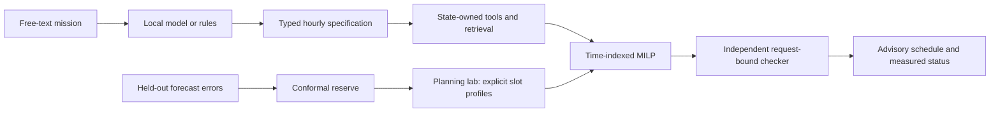

# FlexiGrid AI

Evidence-grounded household energy planning with a local language model, explicit numerical constraints, and independently checked schedules.

**Research prototype. Advisory only. No real devices are controlled.**

[Research review and upgrade rationale](docs/RESEARCH_UPGRADE.md) · [Independent validation addendum](docs/INDEPENDENT_VALIDATION.md) · [Current evaluation](backend/evaluation/RESULTS.md) · [Planner benchmark](backend/evaluation/planning_results.json) · [Demo guide](docs/DEMO_AND_DEFENSE.md)


## Two ways to use it

**Mission planner:** describe a household task in English. A local model or labelled rule-based fallback extracts a specification, retrieves evidence, and uses MCP-compatible tools. An hourly MILP computes the schedule. A mandatory local gate checks it against the extracted specification before explanation. Four catalog devices are supported. Review the extracted constraints: language understanding, actual room temperature and EV state of charge are not verified.

**Planning lab:** specify a numerical problem directly, using 15-, 30- or 60-minute slots, variable appliance profiles, background load, an explicit forecast-error reserve, hard avoid slots, fixed starts and a not-before slot for new decisions. Inspect computed load traces, energy, cost, solver status, remaining optimality gap and the input fingerprint. Import or export JSON. This interface requires the real Python backend and does not fabricate an offline result.

The original offline frontend demonstration remains separate and labelled; it is not the advanced MILP solver.

## Research-backed planning upgrade

- Time-indexed MILP through SciPy/HiGHS, with a bounded exhaustive development oracle and a separately implemented benchmark reference.
- Power- and duration-weighted objectives. Cost means monetary cost; grid means stress-weighted energy. Zero and negative input prices are supported.
- Advanced capacity accounting includes forecast background plus flexible load plus reserve. Legacy plans explicitly cover controllable loads only.
- One-sided, whole-block split-conformal reserve calibration from held-out forecasts and actuals, with finite-sample rank correction and explicit exchangeability assumptions.
- State-owned tool arguments, prerequisite checks and mission-bound final validation. Model suggestions cannot replace the schedule or capacity used by the validator.
- Conservative hourly rule-parser rounding and rejection of impossible windows. The sanitizer no longer moves a task earlier just to make it fit.
- Citation ID validity is labelled honestly. It is not semantic citation support, and empty retrieval does not produce an invented citation.
- Automated backend/MCP, frontend, type-check and benchmark workflows.

The research review maps each change to primary papers, describes the mathematical contract and separates implemented features from future thermal MPC, forecasting, CityLearn, reinforcement learning and federated learning work.

## Architecture



| Component | Responsibility | Source |
| --- | --- | --- |
| Advanced planner | Typed problem, MILP, original-request checker | `backend/flexigrid/planning.py` |
| Uncertainty | Held-out block-max reserve calibration | `backend/flexigrid/uncertainty.py` |
| Hourly compatibility | Legacy task interface, baselines, mission-bound validator | `backend/flexigrid/core.py` |
| Agent and intent | Tool loop, argument ownership, extracted constraints | `agent.py`, `intent.py` |
| Retrieval | BM25, dense embeddings and reciprocal-rank fusion | `retrieval.py`, `embeddings.py` |
| MCP | Existing five-tool registry and stdio host/server | `tools.py`, `mcp_host.py`, `mcp_server.py` |
| Advanced interface | Backend-computed planning and JSON import/export | `components/planning-lab.tsx` |
| Benchmarks | Independent reference, scaling and shift diagnostics | `benchmark_planning.py` |

## Quick start

Python 3.11+ and Node.js 22.13+ are required. From the repository root:

```bash
cd backend
python -m venv .venv
source .venv/bin/activate  # Windows PowerShell: .venv\Scripts\Activate.ps1
pip install -r requirements.txt
cp .env.example .env
uvicorn flexigrid.api:app --host 127.0.0.1 --port 8000
```

In a second terminal:

```bash
npm ci
npm run dev
```

Open `http://localhost:3000` and select **Planning lab**. Load the synthetic sample, solve it, inspect the results and export the request/result pair. The sample prices, stress and background are not live Belgian measurements. A manual reserve is not statistically calibrated.

### Optional local language model

```bash
ollama pull qwen2.5:3b-instruct
ollama pull nomic-embed-text
cd backend
python -m flexigrid.doctor
python -m flexigrid.mcp_host "Charge the EV and run the dishwasher before 07:00"
```

Configure a compatible endpoint in `backend/.env` when using another runtime. Without model weights, the mission planner runs in labelled deterministic mode. The numerical Planning lab never needs an LLM.

### Advanced HTTP API

```bash
curl http://localhost:8000/api/planning/solve \
  -H 'Content-Type: application/json' \
  --data-binary @examples/planning_problem.json
```

Run that command from the repository root. The response includes starts, reconstructed loads and metrics, solver status/gap and a normalized-input SHA-256. Numerical infeasibility returns HTTP 422; stopping without an acceptable incumbent returns 503. The advanced API never silently relaxes hard avoid slots.

`POST /api/planning/validate` independently checks `{ "problem": ..., "starts": ... }`. It reconstructs intervals directly rather than trusting the solver candidate list. `not_before_slot` prevents new decisions from starting in the past while preserving explicitly fixed starts. Timestamps still require caller-side alignment.

Optional sentence-transformer loading uses cached files only and disables remote model code.

`POST /api/planning/calibrate` accepts `forecasts_kw`, `actuals_kw` and `alpha`. Both arrays contain matching held-out whole-horizon blocks. Use forecasts made without the corresponding outcomes. Calibration requires exchangeable blocks and does not provide a drift-robust or physical safety guarantee.

### Elia data

```bash
cd backend
python scripts/fetch_elia_snapshot.py
ELIA_USE_LIVE=true uvicorn flexigrid.api:app --port 8000
```

The mission demo defaults to the explicitly labelled fixture. The derived stress index is not a carbon-intensity or grid-security measurement. Retail tariff remains a separate input. The new lab takes explicit series and does not automatically reinterpret the Elia adapter as a quarter-hour household forecast.

## Verify and reproduce

```bash
npm run lint
npx tsc --noEmit
npm test

cd backend
FLEXIGRID_EMBEDDINGS=tfidf python -m unittest discover -s tests -v
FLEXIGRID_EMBEDDINGS=tfidf python -m flexigrid.evaluate --skip-llm
python -m flexigrid.benchmark_planning
```

`npm test` builds, checks rendered HTML and runs frontend unit tests. Backend tests include real MCP stdio round-trips, numerical edge cases and hostile agent/executor behavior. Model-client tests use a deterministic mock server; passing them does not establish the quality of a real model.

The recorded independent benchmark matched 200 small reference problems: 110 feasible and 90 infeasible, with zero disagreements. Larger 32/64-job cases returned valid time-limited incumbents rather than proven optima. See the JSON for exact gaps, timings, dependency versions and source fingerprint.

The reserve diagnostic achieved 92.8% whole-block coverage on synthetic held-out data, falling to 0.4% after an unmodelled +0.2 kW shift. That failure is intentionally retained. These are implementation diagnostics, not evidence of household savings or coverage on real time series.

Current retrieval/intent results were regenerated in deterministic mode. Historical August model measurements are preserved in `backend/evaluation/historical/`, not presented as measurements of this revision. The inherited 15-mission labels are simplified and require redesign for minute-accurate, per-device evaluation.

## Limits before deployment

The advanced model supports at most 64 non-interruptible jobs and 192 equal elapsed-time slots. Upstream code must align civil dates, timezones, daylight-saving transitions, forecast vintages and units. It does not model electrical transients, network power flows, tariff taxes, thermal comfort, EV state of charge or battery/PV dispatch.

Default CORS permits the local frontend. The advanced solve endpoint admits one numerical solve per backend process and returns HTTP 429 when busy, but the API has no production authentication, distributed request-rate control or device authorization. Do not expose it publicly as-is. A physical pilot needs independently enforced hardware protection, validated equipment models, consent, failure handling and monitored fresh data. Neither an input hash nor a passing numerical checker certifies the real world.

## Earlier academic material

The demo guide and document/deck builders remain available, but their historical narrative and figures may need updating for this architecture. The source screenshot above shows the original dashboard, not a capture of the new Planning lab. Generate academic deliverables separately and verify their descriptions against the current research review before submission.
