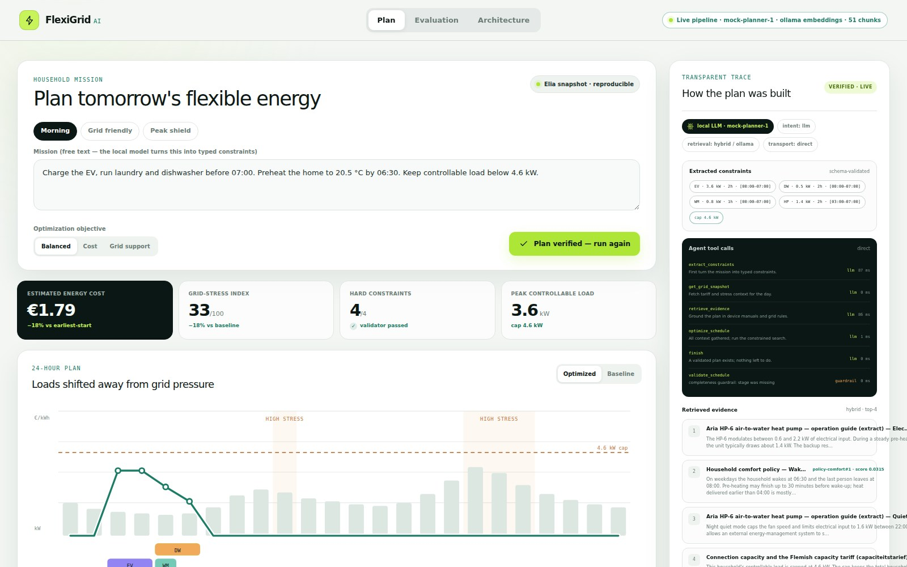

# FlexiGrid AI

A local-LLM agent that plans household energy flexibility for Belgium: free-text missions become typed constraints, a genuine tool-using agent runs over MCP contracts (hybrid RAG, Elia Open Data, a deterministic optimizer), an independent critic gates every plan, and the model's explanation may cite only retrieved evidence. Fully offline — no cloud API key anywhere.

[Technical report](deliverables/FlexiGrid_AI_Technical_Report.pdf) · [Defense deck](deliverables/FlexiGrid_AI_Defense_Deck.pptx) · [Demo guide](docs/DEMO_AND_DEFENSE.md) · [Measured results](backend/evaluation/RESULTS.md)



## The design in one paragraph

The model proposes, code disposes. A local model (default `qwen2.5:3b-instruct` via Ollama) extracts a typed `MissionSpec` from free text — a deterministic sanitizer clamps every value. The same model then drives an agent loop, choosing among five typed tools; guardrails overrule repeated tools and premature finishes, and complete any stage the model skips, with every decision labelled `llm` or `guardrail` in the trace. Schedules come only from a joint constrained search and pass an independent hour-by-hour validator before display. Explanations are schema-constrained and rejected if they cite outside the retrieved allow-list. Remove the model entirely and the pipeline still runs deterministically — clearly labelled as such.

## Architecture


| Layer | Responsibility | Implementation |
| --- | --- | --- |
| Interface | Free-text missions, live agent trace, honest metrics | `components/flexigrid-dashboard.tsx`, `lib/api.ts` |
| Agent | Model-driven tool loop with guardrails and a full trace | `backend/flexigrid/agent.py` |
| Intent | Mission text → typed, sanitized constraints | `backend/flexigrid/intent.py` |
| Retrieval | BM25 + dense embeddings + reciprocal-rank fusion | `backend/flexigrid/retrieval.py`, `embeddings.py`, `ingest.py` |
| Corpus | 15 documents / 51 chunks with source-type labels | `backend/flexigrid/corpus/` |
| Tools & MCP | One registry: FastMCP server + stdio client host + API | `tools.py`, `mcp_server.py`, `mcp_host.py` |
| Data | Elia v2.1 records → derived hourly stress with provenance | `elia_client.py`, `derive.py` |
| Planning | Joint constrained search, greedy ablation, validator | `core.py` |
| LLM | OpenAI-compatible client: json-mode, repair loop, fallback | `llm.py` |
| Evaluation | Retrieval/intent/baseline/ablation harness → results.json | `evaluate.py` |

## Quick start

### 1. Local model (Ollama)

Install [Ollama](https://ollama.com), then:

```bash
ollama pull qwen2.5:3b-instruct
ollama pull nomic-embed-text
```

Any OpenAI-compatible endpoint works instead (LM Studio, llama.cpp server, vLLM) — set `FLEXIGRID_LLM_BASE_URL` / `FLEXIGRID_LLM_MODEL` in `backend/.env`.

### 2. Backend

Requirements: Python 3.11+.

```bash
cd backend
python -m venv .venv
source .venv/bin/activate        # Windows: .venv\Scripts\activate
pip install -r requirements.txt
cp .env.example .env             # Windows: copy .env.example .env
python -m flexigrid.doctor       # verifies corpus, retrieval, LLM, agent, MCP
uvicorn flexigrid.api:app --port 8000
```

`doctor` tells you exactly what is missing and how to fix it. Without any model, everything still runs in labelled deterministic mode.

### 3. Interface

Requirements: Node.js 22.13+.

```bash
npm ci
npm run dev        # http://localhost:3000 — the top bar shows "Live pipeline · <model>"
```

### 4. The agent over a real MCP session

```bash
cd backend
python -m flexigrid.mcp_host "Charge the EV and run the dishwasher before 07:00"
python -m flexigrid.mcp_server     # or serve the tools to any other MCP host
```

### 5. Live Elia data (optional)

```bash
cd backend
python scripts/fetch_elia_snapshot.py   # raw records with timestamps
ELIA_USE_LIVE=true uvicorn flexigrid.api:app   # derive stress from live records
```

The exam demo defaults to the labelled frozen fixture so every number reproduces offline.

## Tests — 93, all offline

```bash
npm test            # frontend: build + rendered-output + engine tests
npm run test:unit   # frontend engine tests only (no build needed)
npm run lint

cd backend
python -m unittest discover -s tests -v   # 85 tests: optimizer, retrieval,
                                          # intent, LLM client, agent guardrails,
                                          # API, MCP stdio round-trip, derivation
```

A deterministic mock LLM server (`backend/flexigrid/dev_mock_llm.py`) ships with the repo, so the complete agent code path — including malformed-JSON repair and rogue-decision guardrails — is tested on machines with no model weights.

## Evaluation

```bash
cd backend
python -m flexigrid.evaluate        # writes evaluation/results.json + RESULTS.md
python ../docs/build_report.py      # report tables refresh from results.json
python ../docs/build_deck.py        # deck numbers refresh too
```

Measured per subsystem: retrieval (40 labelled queries; hit@1 / recall@4 / MRR for BM25, dense, hybrid), intent extraction (15 labelled missions; LLM vs rule-based ablation), **Baseline B** (the LLM scheduling directly — its constraint-violation rate is the argument for the whole architecture), the greedy-search ablation (fails outright where joint search succeeds, including the standard morning mission), citation precision, and deterministic replay. `results.json` records which model and embedding backend produced every number.

## Scope and limitations

- Missions are single-day, four known device types; the intent layer clamps to a device catalog by design.
- Exhaustive joint search is optimal for the small daily problem; production scale needs MILP/CP-SAT behind the same tool contract.
- The stress signal ignores solar, imports and outages — a demonstration-grade ranking signal, documented in the corpus itself.
- Advisory only: no device is ever commanded. A real pilot needs consent, billing contracts, fail-safe control and GDPR controls.
- Local-model quality numbers depend on the machine's model; the harness re-measures in one command and stamps provenance.

## Academic deliverables

- [Technical report — PDF](deliverables/FlexiGrid_AI_Technical_Report.pdf) / [DOCX](deliverables/FlexiGrid_AI_Technical_Report.docx) (regenerate: `python docs/build_report.py`)
- [Defense deck — PPTX](deliverables/FlexiGrid_AI_Defense_Deck.pptx) with speaker notes (regenerate: `python docs/build_deck.py`)
- [Demo & examiner Q&A guide](docs/DEMO_AND_DEFENSE.md) · [Submission checklist](docs/SUBMISSION_CHECKLIST.md)

Before submitting, replace the `project partner` placeholder in the report and deck with the second student's name (or your instructor's solo approval).
